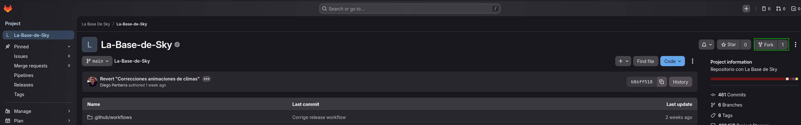
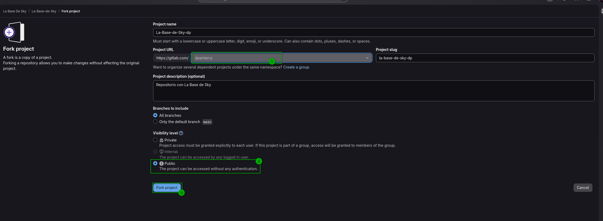
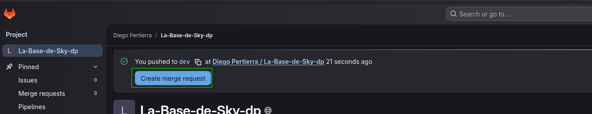
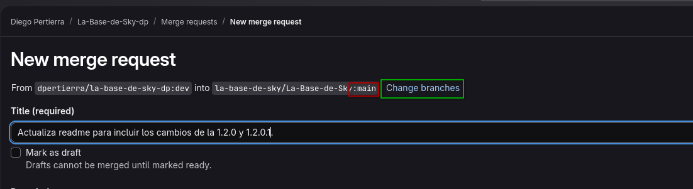
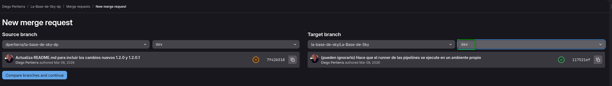
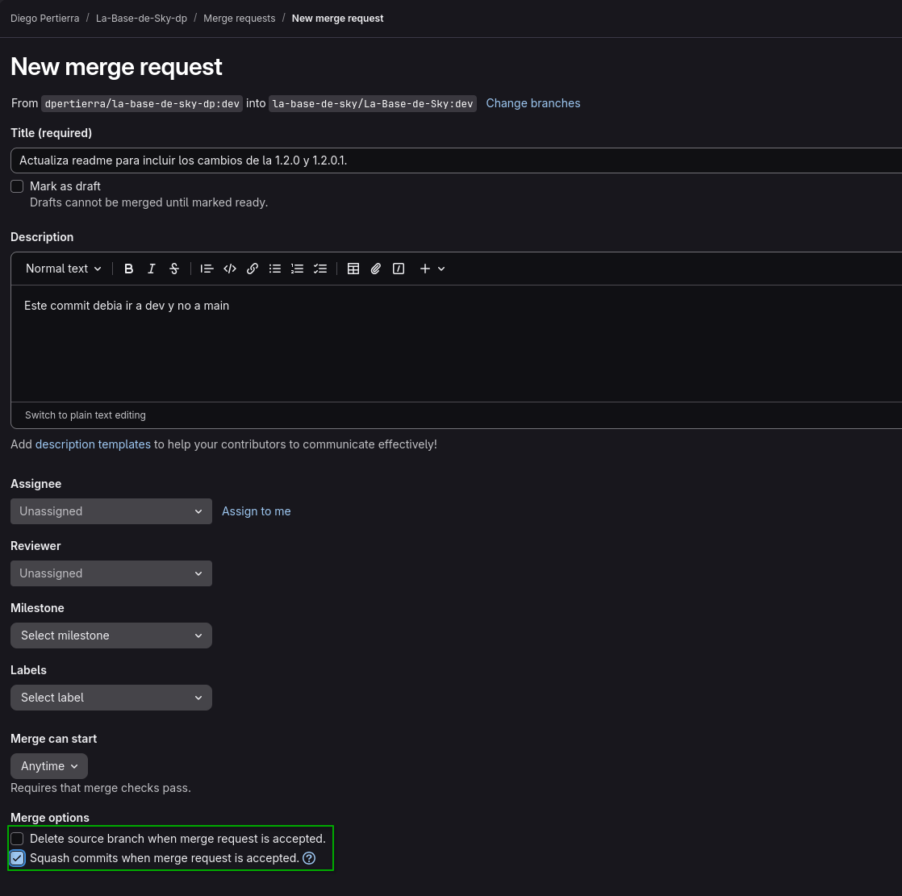
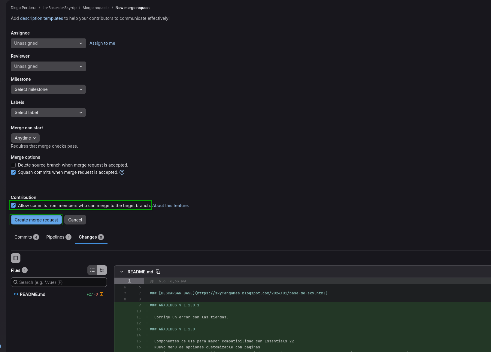
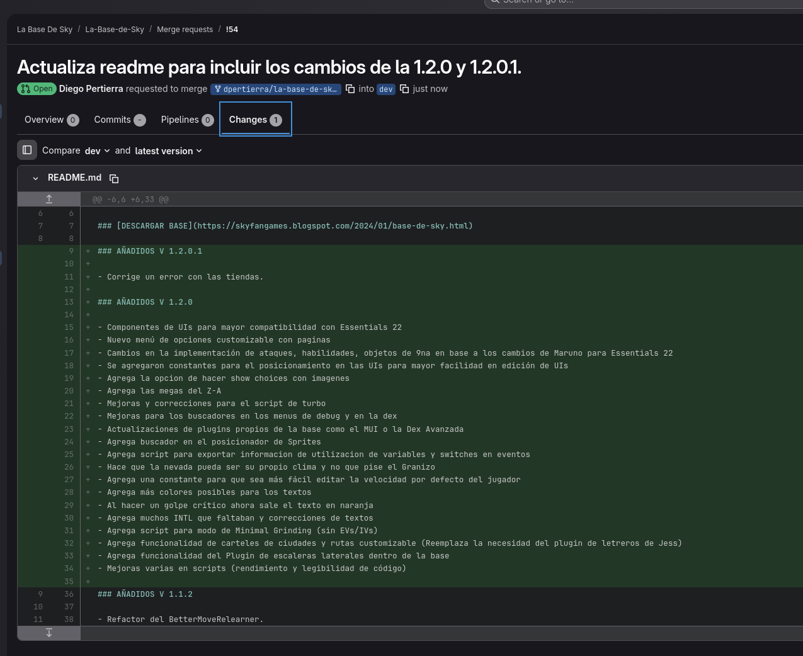

# COMO CONTRIBUIR A LA BASE DE SKY

1. Crear un fork del proyecto en GitLab

Deben seleccionar el grupo donde desean guardar el fork, en mi caso lo voy a guardar en mi cuenta personal, pero si tienen un grupo de trabajo también pueden guardarlo ahí. Luego hacen click en el botón de Fork y listo, ya tienen su propio repo con una copia del proyecto original.

2. Pusheen los cambios que quieran contribuir a la base, ya sea en una nueva branch o en la branch de dev de sus repositorios.
Una vez haya cambios en su repo la página de GitLab les mostrará un banner para crear una Merge Request

3. Hacen click en el botón de Create Merge Request y se aseguran que el target branch sea dev y el source branch sea la branch donde hicieron los cambios. Si no coinciden hacen click en el botón "Change branches" NUNCA DEBEN HACER UNA MR DIRECTA A MAIN, SIEMPRE A DEV

Asegúrense de poner un título descriptivo y una descripción clara de los cambios que hicieron, para que sea más fácil para nosotros entender lo que hicieron y analizarlo.
Otro punto importante es que si no hicieron una branch nueva para estos cambios y utilizaron su branch de dev, no marquen esta opcion "Delete source branch when merge request is accepted. Si no lo hacen, cuando se mergee la MR se va a borrar la branch de dev de su repo y van a tener que volver a hacer un fork para seguir contribuyendo."

4. Al terminar de configurar la MR, hacen click en Create Merge Request y listo, ya tienen su MR creada y Sky, Zik o yo(Diego/DPertierra) podremos analizarla y si está todo bien mergearla. Si hay algo que no nos quede claro podremos pedirles sobre la misma que nos expliquen un poco mas o que le hagan cambios si vemos algo que no está del todo bien.

En este punto ya no tienen que hacer nada más, solo esperar a que se revise su MR y si está todo bien se mergeará a dev. Si hay algún error podemos decidir corregirlo por nuestra cuenta y luego mergear la MR o solicitarles que hagan los cambios necesarios.
> [!WARNING]ADVERTENCIA
> Que creen una MR no significa que esta siempre vaya a ser aprobada, si es una corrección de un error y está bien hecha casi seguro que si, se aprobará.
>
> Pero si es una funcionalidad nueva o mejora veremos que tanto aporta y decidiremos si se aprueba o no.
> Todas las MR que se haga directo a la branch main serán rechazadas.